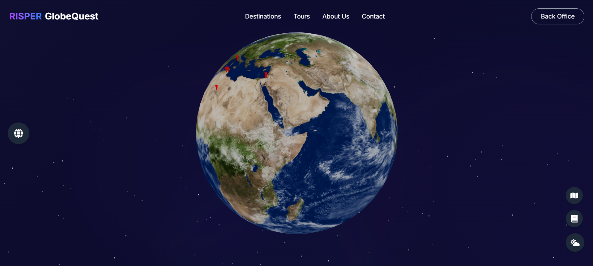

# GlobeQuest

GlobeQuest is a 3D Tour Management System built with Next.js ,React-Three-Fiber and Supabase. It provides a 3D globe for user interaction, along with a back office for managing guides and tours.



## Getting Started

First, run the development server:

```bash

GlobeQuest - PFE>npm install
GlobeQuest - PFE\backend> uvicorn recommendation:app --reload
GlobeQuest - PFE>npm run dev


```


